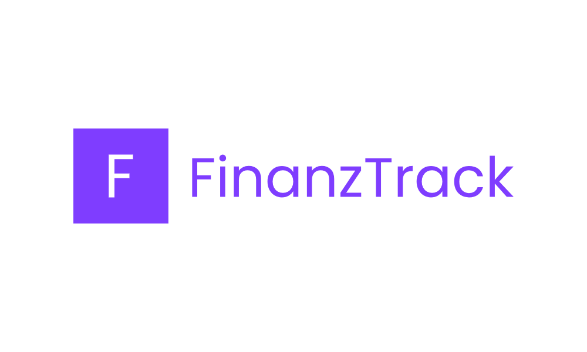
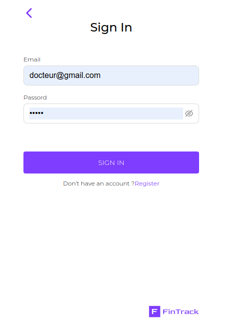
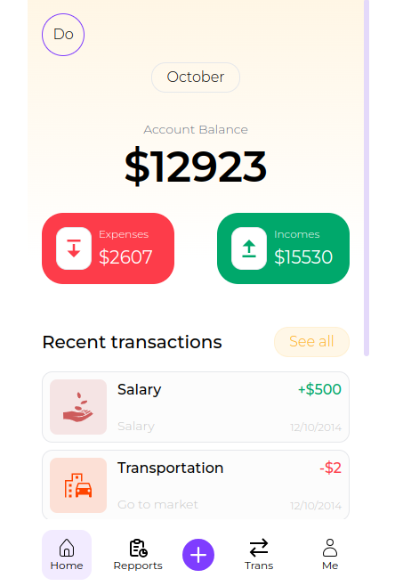
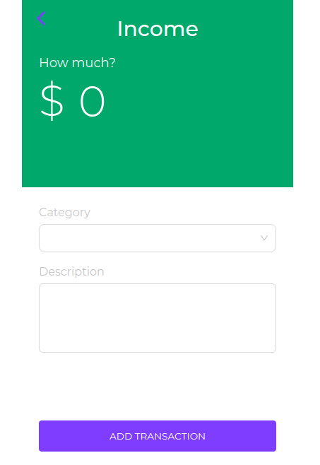
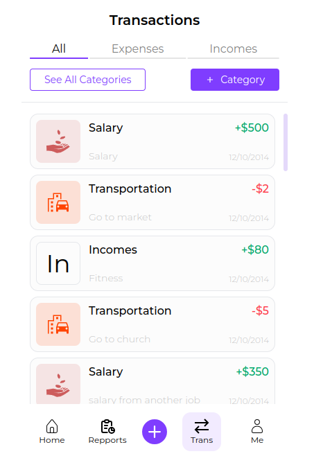

# FinanzTrack - Your Personal Financial Tracking Application




### INTRODUCTION


A comprehensive financial tracking application that assists users in managing their personal finances and expenses.

- Blog post:
- Author: CREDO23 <bakerathierry@gmail.com>
- Live link: [FinanzTrack](https://finanztrack.vercel.app/)
- Api : [FinanzTrack API](https://github.com/CREDO23/finanzTrack-bc)


### FEATURES


1. #### Expenses Tracking

Effortlessly record your expenses on-the-go. Categorize and tag transactions to gain a comprehensive overview of your spending habits.

2. #### Incomes Tracking

Track your various income sources and get a clear picture of your overall financial inflow. 

3. #### Repports generation

Generate a report whenever you want for your financial state, helping you identify trends and make informed decisions.


### USAGE


- **Dashboard Overview** : The dashboard provides a snapshot of your financial status, including current balance, expenses, and income.
- **Add Transactions** : Tap on the '+' button to add a new transaction. Choose the type (income or expense). Then set the amount, category, and any additional details.
- **All transactions** : Tap on the 'trans' button, you will see a list of all transactions you have created, you can choose to see expenses or incomes only by selecting the appropriate tab.
In this section, you can also see transactions categories and create new one.
- **Reports and Insights** : Explore the 'Reports' tab to view detailed financial reports. Understand where your money is going and identify areas for improvement.


### SCREENSHOTS

<div style="display:flex;">




</div>


### CONTRIBUTING


Whether you're a developer, designer, or someone passionate about improving financial tracking experiences, your input is valuable

#### How to Contribute

1. **Fork the Repository** : Start by forking the FinanzTrack repository to your own GitHub account.
2. **Clone the Repository** : Clone the forked repository to your local machine using the following command:
```bash
    git clone https://github.com/CREDO23/finanzTrack-fr.git
```
3. **Create a Branch** : Create a new branch for your contribution. Use a descriptive branch name that summarizes your changes.
```bash
    git checkout -b feature/new-feature
```
4. **Make Changes** : Implement your enhancements or fixes. Ensure that your code follows the existing coding standards.
5. **Test Your Changes** : Before submitting a pull request, test your changes thoroughly to ensure they work as intended.
6. **Commit Your Changes** : Commit your changes with clear and concise commit messages.
```bash
    git commit -m "Add feature: new feature"
```
7. **Push to Your Fork** : Push your changes to your forked repository on GitHub.
```bash
    git push origin feature/new-feature
```
8. **Submit a Pull Request** : Open a pull request on the main FinanzTrack repository. Provide a detailed description of your changes and why they should be merged.

#### Code Guidelines

- Follow the existing code style and structure.
- Comment your code where necessary to enhance readability.
- Write clear commit messages.
- Test your changes thoroughly.

#### Reporting Issues

If you come across a bug or have a feature request, please open an issue on the FinanzTrack repository. Provide as much detail as possible to help us understand and address the issue promptly.


### LICENSE
FinanzTrack is released under the MIT License.


### Related Projects
- [Mint](https://mint.intuit.com/)
- [Quicken](https://www.quicken.com/)